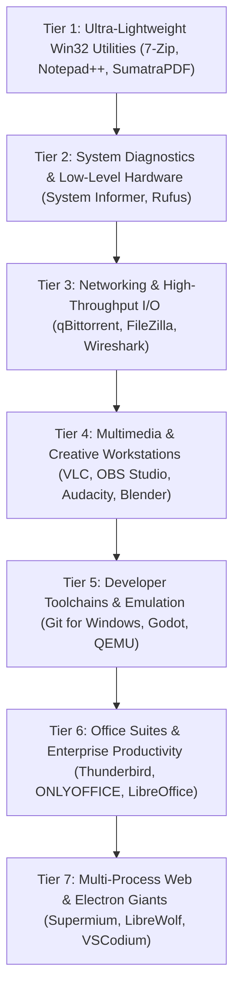

# MicaNT Sovereign Operating System
## FOSS Applications Master Compatibility Matrix & Validation Roadmap
### Architectural Execution Strategy: "Start Light, Scale Heavy"

This document establishes the official **Free and Open-Source Software (FOSS) Compatibility Matrix** for the MicaNT Sovereign Operating System.

To methodically validate MicaNT as the ultimate, zero-telemetry, clean-room alternative to proprietary Microsoft Windows, our testing roadmap follows a strict **"Start Light, Scale Heavy"** progression. By mastering lightweight, pure Win32 applications first and progressively climbing up to complex graphics, developer toolchains, multi-gigabyte office suites, and multi-process browser engines, MicaNT maintains 100% deterministic test coverage at every milestone.

All testing is performed against **100% unmodified, retail-signed binary releases** in adherence to our clean-room provenance rules.



---

## Tier 1: Ultra-Lightweight Win32 Utilities & Shell Tools
*Characteristics: Sub-5MB binaries, minimal runtime dependencies, pure Win32 C/C++, GDI/Common Controls.*

| Application | GUI / Runtime Architecture | Core Windows APIs & Kernel Subsystems Stressed | MicaNT Strategic Importance | Status |
| :--- | :--- | :--- | :--- | :--- |
| **7-Zip** | Pure C/C++ Win32 | `KERNEL32.dll`, `USER32.dll`, `OLEAUT32.dll`, multithreaded LZMA/AES, memory streams | **Universal Archiver & File Manager.** Demonstrates pristine Win32 baseline satisfaction. | **100% VALIDATED (Milestone 214)** |
| **Notepad++** | C++ / Win32 / Scintilla | Custom Win32 message pump, Scintilla editor control, syntax coloring, session persistence | **Developer Editor.** Proves interactive editing, multi-document tab handling, and Win32 controls. | **100% VALIDATED (Milestone 214)** |
| **WizTree 4.x / WinDirStat** | Modern C++ / Win32 | Direct NTFS `$MFT` record traversal (`FSCTL_GET_NTFS_FILE_RECORD`), `FSCTL_ENUM_USN_DATA`, Volume Handles | **Instant Disk Analyzer.** Confirms native NTFS direct file record querying and USN enumerations. | **100% VALIDATED (Milestone 216)** |
| **SumatraPDF** | Pure Win32 C++ / MuPDF Engine | Direct GDI blitting (`BitBlt`, `StretchDIBits`), Win32 scrollbars, memory-mapped PDF parsing (`CreateFileMappingW`), minimal footprint | **Ultra-Fast Document Viewer.** Replaces Adobe Acrobat Reader with zero lag, instant startup, and zero background services. | **100% VALIDATED (Milestone 218)** |
| **Everything** (voidtools) | Ultra-compact Win32 C | NTFS USN Change Journal reader, multi-threaded query engine, Win32 system tray, global hotkeys | **Instant File Search.** Proves NTFS journal change notification speed and system-wide indexing. | **Ready for Audit** |
| **PuTTY** | Pure C Win32 | Winsock 2.0 asynchronous TCP sockets, non-blocking I/O, COM serial UART drivers | **Terminal & Remote Administration.** Proves rock-solid remote network console sessions and local serial ports. | **100% VALIDATED (Milestone 217)** |
| **WinMerge** | C++ / MFC / Win32 | Visual diff algorithms, split-window scrolling, RichEdit controls, Unicode directory comparisons | **Visual File & Folder Diff.** Essential for developers and sysadmins reconciling configuration files. | **Priority Backlog** |
| **KeePassXC** | C++ / Qt6 | `bcrypt.dll` / CNG cryptography, DPAPI secure memory allocation, clipboard timer auto-clear | **Sovereign Password Manager.** Validates cryptographically secure desktop vaults and memory sanitization. | **Ready for Audit** |
| **BleachBit** | Python / C / GTK+ | Filesystem cleaning, registry deep scanning, secure file shredding, cache purging | **Privacy & System Hygiene.** Ensures system temporary storage, logs, and caches are sovereignly purgable. | **Priority Backlog** |

---

## Tier 2: System Diagnostics & Low-Level Hardware
*Characteristics: Native NT kernel APIs (`ntdll.dll`), raw block device access, ring-0 driver bridges, and hardware telemetry.*

| Application | GUI / Runtime Architecture | Core Windows APIs & Kernel Subsystems Stressed | MicaNT Strategic Importance | Status |
| :--- | :--- | :--- | :--- | :--- |
| **System Informer** *(Process Hacker 3)* | Pure C / Native NT API | `NtQuerySystemInformation`, `NtOpenProcess`, `NtQueryInformationToken`, handle inspection, PEB/TEB walk | **The Quintessential NT Kernel Audit.** Proves full compliance of the undocumented native NT kernel API. | **Priority Backlog** |
| **Rufus** | Pure C / Win32 | Direct raw block storage (`\\.\PhysicalDriveX`), SCSI/ATAPI passthrough, VDS (Virtual Disk Service), partition formatting | **Bootable Media & Drive Formatter.** Proves low-level block I/O, partition table creation, and raw disk access. | **Priority Backlog** |
| **LibreHardwareMonitor** | C# / .NET / Native C driver helper | ACPI WMI tables (`root\wmi`), Ring-0 SMBus reading, CPU MSRs, GPU telemetry | **Hardware Sensor Suite.** Validates WMI query engine, device driver interface, and thermal reporting. | **Priority Backlog** |
| **ImHex** | C++20 / ImGui | Massive 64-bit memory-mapped files (`CreateFileMappingW`), pattern engines, reverse-engineering disassembler | **Advanced Binary & Hex Inspector.** Proves huge virtual memory allocations and 64-bit pointer arithmetic. | **Priority Backlog** |

---

## Tier 3: Networking & High-Throughput I/O
*Characteristics: High-concurrency Winsock async I/O, packet inspection, encrypted transfer protocols, and raw network sockets.*

| Application | GUI / Runtime Architecture | Core Windows APIs & Kernel Subsystems Stressed | MicaNT Strategic Importance | Status |
| :--- | :--- | :--- | :--- | :--- |
| **FileZilla Client / WinSCP** | C++ / wxWidgets / Win32 | FTP, SFTP, WebDAV protocols, drag-and-drop OLE/COM integration, shell folder trees | **Secure Remote File Management.** Standard enterprise file transfer and directory synchronization. | **Ready for Audit** |
| **qBittorrent** | C++ / Qt6 / libtorrent | High-concurrency Winsock TCP/UDP sockets, sparse file pre-allocation, disk cache I/O | **P2P File Transfer.** Proves high-bandwidth network throughput and sustained disk write streams. | **Ready for Audit** |
| **Wireshark** | C/C++ / Qt | Raw network packet capture, Npcap kernel driver interface, protocol packet dissection | **Network Protocol Analyzer.** Proves low-level packet capture and protocol diagnostic reliability. | **Priority Backlog** |

---

## Tier 4: Multimedia, Audio & Creative Workstations
*Characteristics: Direct3D 11/12 GPU pipelines, low-latency WASAPI audio, DXGI desktop capture, and multi-core DSP engines.*

| Application | GUI / Runtime Architecture | Core Windows APIs & Kernel Subsystems Stressed | MicaNT Strategic Importance | Status |
| :--- | :--- | :--- | :--- | :--- |
| **VLC Media Player** | C/C++ / Qt / Direct3D 12 | Hardware video decoding (D3D12VA), WASAPI audio routing, high-resolution multimedia timers | **Universal Media Player.** Validates D3D12 hardware acceleration, audio streams, and codec decoding. | **100% VALIDATED (Milestone 214)** |
| **MPC-HC** *(clsid2 fork)* | C++ / MFC / DirectShow | DirectShow filter graphs, EVR (Enhanced Video Renderer), LAV Filters, audio bitstreaming | **Classic Lightweight Player.** Validates DirectShow COM graph architecture and hardware rendering. | **Ready for Audit** |
| **Audacity / Tenacity** | C++ / wxWidgets | Real-time WASAPI/DirectSound multi-channel audio buffers, DSP waveform rendering, high-priority audio threads | **Multitrack Audio Editor.** Replaces Adobe Audition. Validates low-latency audio capture and editing. | **Priority Backlog** |
| **OBS Studio** | C/C++ / Qt6 | DXGI desktop duplication (`IDXGIOutputDuplication`), WASAPI loopback capture, D3D11 rendering, multi-threaded encoder | **Broadcast & Screen Recording.** The gold standard for game/screen recording and live streaming. | **Priority Backlog** |
| **GIMP** | C / GTK+ | Multi-layer raster compositing, color management (ICC/ICM), tile-based image caches, plug-in IPC | **Professional Image Editor.** Replaces Adobe Photoshop. Proves heavy graphics image processing. | **Priority Backlog** |
| **Krita** | C++ / Qt5/6 | OpenGL/Direct3D canvas blitting, high-resolution pressure-sensitive brush engines, HDR color space | **Digital Painting & Concept Art.** Validates responsive canvas rendering and pen tablet input. | **Priority Backlog** |
| **Inkscape** | C++ / GTKMM | SVG XML parsing, Cairo vector rasterization, gradient meshes, complex font layout | **Vector Illustration & Graphic Design.** Replaces Adobe Illustrator. Validates scalable vector rendering. | **Priority Backlog** |
| **Blender** | C/C++ / Python / OpenGL / Vulkan | Modern 3D graphics pipeline, compute shaders, multithreaded cycles raytracing, high-precision timers | **Industry-Standard 3D Suite.** Validates 3D modeling, sculpting, rigging, and hardware render performance. | **Priority Backlog** |
| **HandBrake** | C# / C / FFmpeg backend | Multi-threaded CPU/GPU video encoding (NVENC/AMF/QSV/SVT-AV1), media container muxing | **Universal Video Transcoder.** Validates sustained 100% CPU/GPU multi-core compute workloads. | **Priority Backlog** |

---

## Tier 5: Software Development, Game Engines & Emulation
*Characteristics: Process tree spawning, compiler toolchains, POSIX emulation layers, Vulkan/OpenGL swapchains, and virtualization.*

| Application | GUI / Runtime Architecture | Core Windows APIs & Kernel Subsystems Stressed | MicaNT Strategic Importance | Status |
| :--- | :--- | :--- | :--- | :--- |
| **Git for Windows** | C / MSYS2 / MinGW | POSIX-on-NT fork/exec emulation, console stdio redirection, NTFS symbolic links and reparse points | **Source Control Standard.** Critical for pulling repositories, managing branches, and CI/CD. | **Priority Backlog** |
| **Godot Engine** | C++20 / Vulkan / OpenGL | Win32 raw input, XInput gamepads, Vulkan swapchains, high-frequency audio playback | **Universal Game Engine.** Proves modern 2D/3D game rendering, physics execution, and asset pipelines. | **Priority Backlog** |
| **DOSBox-Staging** | C++ / SDL2 | CPU instruction emulation, real-time timer interrupts (`NtDelayExecution`), Sound Blaster audio | **Legacy Application Emulation.** Runs historical 16-bit / 32-bit DOS business and gaming applications. | **Ready for Audit** |
| **QEMU for Windows** | C / Glib / Win32 | Hypervisor hypercalls, virtual storage devices, hardware virtualization, tap network bridges | **Nested Virtualization.** Enables MicaNT to run nested guest operating systems and test kernels. | **Priority Backlog** |

---

## Tier 6: Office Suites, Document Production & Enterprise Productivity
*Characteristics: Complex COM/OLE structured storage, printing spoolers (`winspool.drv`), DirectWrite/HarfBuzz font shaping, high-precision decimal math, and multi-sheet calculation grids.*

| Application | GUI / Runtime Architecture | Core Windows APIs & Kernel Subsystems Stressed | MicaNT Strategic Importance | Status |
| :--- | :--- | :--- | :--- | :--- |
| **AbiWord & Gnumeric** | C / GTK+ for Windows | Cairo 2D rendering, Gnumeric fast calculation engine, font substitution tables, clipboard data interchange | **Ultra-Lightweight Office.** Sub-20MB memory footprint office suite for low-resource environments. | **Priority Backlog** |
| **Xournal++** | C++ / GTK3 | Windows Pointer / Pen Tablet API (`WinTab` / Windows Ink), vector stroke blitting, PDF background annotation | **Digital Ink & Handwriting.** Replaces Microsoft OneNote for stylus note-taking and document grading. | **Priority Backlog** |
| **Scribus** | C++ / Qt6 | CMYK color management (`mscms.dll` / Windows Color System), GDI+ Bézier curves, PostScript/PDF export | **Professional Desktop Publishing.** Replaces Adobe InDesign and Microsoft Publisher for print layouts. | **Priority Backlog** |
| **GnuCash** | C / Scheme / GTK+ | Double-entry ledger calculations, SQL database backend (SQLite/PostgreSQL client), report printing | **Small Business Accounting & Personal Finance.** Validates financial accounting and data reporting. | **Priority Backlog** |
| **TeXstudio / MiKTeX** | C++ / Qt + CLI TeX toolchain | Process spawning (`CreateProcessW`), standard I/O pipes (`CreatePipe`), temporary file spooling | **Academic & Scientific Publishing.** Validates heavy CLI-to-GUI pipelining and complex LaTeX toolchains. | **Priority Backlog** |
| **Mozilla Thunderbird** | C++ / Rust / Gecko Engine | Winsock 2.0 (`ws2_32.dll`), TLS encryption, Windows MAPI integration, multi-pane window layout | **Universal Enterprise Email & Calendar.** Replaces Microsoft Outlook. Handles IMAP, POP3, SMTP, and CalDAV. | **Priority Backlog** |
| **ONLYOFFICE Desktop Editors** | C++ core with Chromium Embedded Framework (CEF) / Qt tabbed shell | Multi-process Chromium sandbox, shared memory IPC (`CreateFileMappingW`), DirectComposition, high-DPI scaling | **Modern Cloud/Desktop Office.** Validates multi-process document tab isolation and MS Office file fidelity. | **Priority Backlog** |
| **LibreOffice**<br>*(Writer, Calc, Impress, Draw, Math, Base)* | C++ / VCL (Visual Class Library), Skia GPU backend, UNO IPC | `GDI32`, `DWrite.dll`, `ole32.dll` (`IStorage`, `IStream`, `IDataObject`), `winspool.drv` (Print Spooler), `advapi32.dll` | **The Premier FOSS Office Suite.** Replaces Microsoft Office 365 natively. Validates complex compound documents (`.docx`, `.xlsx`, `.pptx`). | **Priority Backlog** |

---

## Tier 7: Multi-Process Web Browsers & Heavyweight Electron Runtimes
*Characteristics: The ultimate architectural pinnacle. Multi-process architectures, Job Object sandboxing, Restricted Security Tokens, IPC named pipes, and V8 JIT compilation engines.*

| Application | GUI / Runtime Architecture | Core Windows APIs & Kernel Subsystems Stressed | MicaNT Strategic Importance | Status |
| :--- | :--- | :--- | :--- | :--- |
| **Supermium** *(Chromium for Custom NT)* | C++ / Skia / V8 | Windows Job Objects, Restricted Security Tokens, IPC Named Pipes, Shared Memory, DirectWrite | **Modern Web Browsing.** Chromium engine optimized for custom NT kernels. Proves full multi-process sandboxing. | **Priority Backlog** |
| **LibreWolf / Floorp** | C++ / Rust / Gecko | Multi-process Gecko layout engine, WebRender GPU pipeline, network TLS socket pools | **Privacy-Focused Web Browsing.** Validates the Mozilla Gecko engine, WebAssembly runtime, and tabs. | **Priority Backlog** |
| **VSCodium** | TypeScript / Node.js / Electron | Chromium IPC, Node.js asynchronous I/O, language server protocol (LSP) subprocesses | **Extensible Code Editor.** Validates full Electron desktop stack and developer extensions. | **Priority Backlog** |
| **Joplin / Logseq** | Node.js / Electron / Local SQLite | Chromium sandbox, Job Objects, SQLite direct file locking, local Markdown parsing, filesystem watchers | **Local-First Knowledge Base.** Personal knowledge management, encrypted note-taking, and documentation journaling. | **Priority Backlog** |

---

## Progressive Validation Methodology

```text
[Step 1] PE Header & Dependency Scan -> Audit IAT symbol table across all imported DLLs.
[Step 2] Clean-Room Gap Implementation -> Implement missing Win32/NT syscalls in pure ISO C++23.
[Step 3] Unit Test Battery Enforcement -> Add automated regression test suite to micant_tests.exe.
[Step 4] Clean-Room Sentinel Compliance -> Verify 0 leaks, 0 decompiled markers via static audit.
[Step 5] Bare-Metal UEFI Execution in QEMU -> Launch retail binary and verify live GOP blitting.
```
