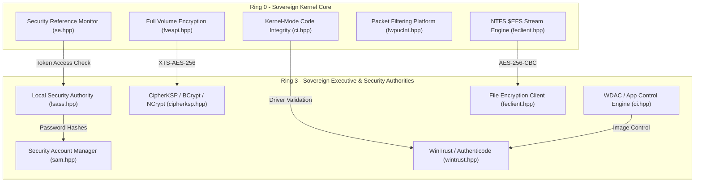
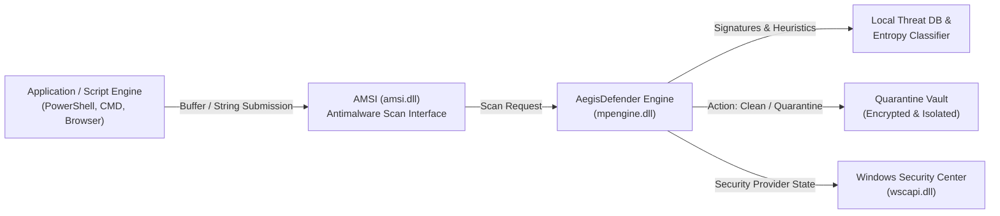

# Sentinel Security System for MicaNT: Sovereign Architecture & Endpoint Protection Roadmap

**Document Reference:** `docs/SECURITY_ROADMAP.md`  
**Classification:** Sovereign Systems Architecture & Defense Blueprint  
**Subsystem Lineage:** Project MICA (Dave Cutler 1988) ➔ Sentinel Security System (SentinelSec, SentinelCenter, AegisDefender)  
**Status:** Active Architectural Charter  

---

## 1. Executive Summary

In Windows, the security model relies on a mix of Ring 0 kernel isolation and a sprawling collection of user-mode daemons (Windows Defender / `MsMpEng.exe`, Security Center / `wscsvc`, SmartScreen, and Defender for Endpoint / ATP). While historically effective, the commercial Windows implementation suffers from:
1. **Intrusive Telemetry**: Every executable hash, script invocation, and document metadata is frequently beaconed to the cloud (SmartScreen / Defender ATP cloud telemetry).
2. **Resource Bloat**: Windows Defender often consumes 250 MB to 1+ GB of idle RAM and causes aggressive CPU spikes during routine I/O.
3. **Black-Box Decision Logic**: Threat heuristics and cloud-dependent signatures provide little transparency to systems engineers and security auditors.

**MicaNT's Security Mandate:** Build a **first-principles, sovereign, memory-safe (ISO C++23), 100% telemetry-free** security and endpoint protection ecosystem that provides complete Win32/NT ABI compatibility while running in sub-32 MB of memory with deterministic latency and absolute user sovereignty.

---

## 2. Current State: MicaNT Security Foundations (Phases 1–108)

MicaNT already possesses one of the most complete, verified clean-room cryptographic and access-control foundations ever constructed:

### Deployed Subsystems (135/135 Test Suites Passing):
1. **SentinelSec (`se.hpp`, `sam.hpp`, `lsass.hpp`)**:
   - Security Reference Monitor (SRM), Security Descriptors, DACLs, SACLs, Access Tokens (`SeAccessCheck`, `NtOpenProcessToken`).
   - SAM user/group database with salted PBKDF2/SHA-256 password hashing.
   - Privilege validation (`SeDebugPrivilege`, `SeShutdownPrivilege`, etc.).
2. **CipherKSP (`cipherksp.hpp`, `bcrypt.dll`, `ncrypt.dll`)**:
   - Cryptography Next Generation (CNG) parity: SHA-256/384/512, AES-128/256 (CBC, CTR, ECB, XTS), CSPRNG.
3. **Full Volume Encryption / FVE (`fveapi.hpp`, `fveapi.dll`, `manage-bde`)**:
   - BitLocker volume encryption compatibility, TPM 2.0 PCR-7/11 sealing, 48-digit numerical recovery passwords.
4. **Windows Filtering Platform / WFP (`fwpuclnt.hpp`, `fwpuclnt.dll`, `netsh advfirewall`)**:
   - Deep packet inspection, stateful IPv4/IPv6 packet filtering, application-aware network isolation.
5. **WinTrust & CatRoot (`wintrust.hpp`, `wintrust.dll`, `signtool`)**:
   - Authenticode PKCS#7 digital signature validation, PE SHA-256 Authenticode hashing, security catalog database.
6. **Code Integrity & WDAC (`ci.hpp`, `ci.dll`, `wdac`)**:
   - Kernel-Mode Code Integrity (KMCI) driver enforcement, User-Mode Code Integrity (UMCI / WDAC) allow/deny rules (Hash, Publisher, Path), HVCI simulation.
7. **Encrypting File System / EmeraldCrypt (`feclient.hpp`, `feclient.dll`, `cipher`)**:
   - Per-file AES-256 symmetric encryption, NTFS `$EFS` alternate data stream, multi-user DDF, corporate DRA recovery, zero-knowledge raw streaming, DoD 5220.22-M disk sanitization.
8. **AegisSandbox (`ps.hpp`, `section.hpp`)**:
   - Win32 Job Object containment, CPU rate limits, working-set memory fences.
9. **WebAuthn / FIDO2 (`webauthn.hpp`, `webauthn.dll`)**:
   - Hardware passkeys and credential generation.

---

## 3. Gap Analysis: What Windows Defender Provides vs. What MicaNT Needs

To achieve full operational parity with Windows Defender without any of the cloud-telemetry downsides, MicaNT requires the following five layers:

| Security Dimension | Proprietary Windows Implementation | MicaNT Sovereign Solution |
| :--- | :--- | :--- |
| **System Health Aggregation** | Windows Security Center (`wscapi.dll` / `wscsvc`) | **SentinelCenter (`wscapi.hpp`)**: Real-time aggregation of Firewall, Defender, BitLocker, and UAC with standard Win32 C ABI. |
| **Runtime Script & Buffer Inspection** | Antimalware Scan Interface (`amsi.dll`) | **Sovereign AMSI (`amsi.hpp`)**: `AmsiScanBuffer` & `AmsiScanString` allowing shells and script runtimes to scan memory before execution. |
| **Antivirus / Threat Detection Engine** | Microsoft Malware Protection Engine (`mpengine.dll` / `MsMpEng.exe`) | **AegisDefender (`mpengine.hpp`)**: Local-first scan engine with signature pattern matching, PE section entropy analysis, and quarantine vault. |
| **Cloud Surveillance / Telemetry** | SmartScreen / Defender ATP cloud telemetry (beacons data to MS servers) | **Zero Cloud Transmission**: 100% offline, local heuristic analysis with optional reproducible open-source definition updates. |
| **Process Exploit Mitigations** | Windows Exploit Guard (DEP, ASLR, CFG, ACG) | **Process Mitigation Policy (`mitigation.hpp`)**: Ring 0 hardware NX/DEP bit enforcement, ASLR address randomization, strict handle limits. |
| **Credential Dumping Defense** | Credential Guard / Virtualization-Based Security (IUM) | **Sovereign Credential Guard (`credguard.hpp`)**: Isolated token vault preventing unprivileged Ring 3 memory reads of SAM/LSA secrets. |

---

## 4. The Sovereign Sentinel Security Roadmap

### Phase 1: Windows Security Center Subsystem (`wscapi.dll` / `wscapi.h` - SentinelCenter) - **COMPLETED (Milestone 136)**
- **Goal**: Build the central health aggregator for the entire operating system.
- **Implemented Components**:
  - `include/micant/wscapi.hpp` exporting `wscapi.dll`.
  - Win32 C ABI: `WscGetSecurityProviderHealth`, `WscRegisterForChanges`, `WscUnRegisterChanges`, `WscQueryAntiVirusStatus`, `WscRegisterProduct`, `WscUnregisterProduct`, `WscUpdateProductStatus`, `WscGetAntiVirusProducts`, `WscFreeMemory`.
  - COM Interfaces: `IWscProduct`, `IWscProduct2`, `IWscProduct3`, `IWSCProductList` with standard reference counting.
  - Pre-seeded Providers: Firewall (WFP), Antivirus (AegisDefender), Servicing (CBS), User Account Control (UAC), Core Service (`wscsvc`).
  - CLI: `wsc` (`wsc status`, `wsc health [provider]`, `wsc products`, `wsc test`).
  - Verification: Unit Test Suite 136 (`Test_WindowsSecurityCenter_WSC_Subsystem`) passing at 100%.

### Phase 2: Antimalware Scan Interface (AMSI - `amsi.dll` / `amsi.h` - SentinelScan) - **COMPLETED (Milestone 137)**
- **Goal**: Enable applications, scripts, and command shells to submit code buffers to the antimalware engine before execution.
- **Implemented Components**:
  - `include/micant/amsi.hpp` exporting `amsi.dll` (SentinelScan).
  - Win32 C ABI: `AmsiInitialize`, `AmsiOpenSession`, `AmsiScanBuffer`, `AmsiScanString`, `AmsiNotifyOperation`, `AmsiCloseSession`, `AmsiUninitialize`, `AmsiResultIsMalware`, `AmsiResultIsBlockedByAdmin`, `AmsiResultIsValid`.
  - COM Interfaces: `IAmsiStream` (`{3E47F2E5-81D4-4AE7-897E-585A823CE1F8}`), `IAmsiProvider` (`{B2CABFE3-F61D-4729-A586-64623C669004}`).
  - Built-in Sovereign Provider: `SovereignSentinelScanProvider` with NOP sled/shellcode detection, malicious download cradle analysis, credential theft pattern matching, AMSI tampering defense, and Shannon block entropy classification.
  - Interactive Shell Pre-Execution Inspection: Automatic interception and blocking of malicious commands (`0x800700DF` `ERROR_VIRUS_INFECTED`) and admin policy blocks in `include/micant/shell.hpp`.
  - CLI: `amsi` (`amsi status`, `amsi scan <content>`, `amsi block <pattern>`, `amsi unblock <pattern>`, `amsi clear`, `amsi test`).
  - Verification: Unit Test Suite 137 (`Test_WindowsAMSI_SentinelScan_Subsystem`) passing at 100%.

### Phase 3: AegisDefender Antimalware Engine (`mpclient.dll` / `mpengine.dll` / `MpCmdRun.exe`) - **COMPLETED (Milestone 138)**
- **Goal**: Full clean-room file scanner and threat remediation engine with zero background telemetry.
- **Implemented Components**:
  - `include/micant/mpengine.hpp` exporting `mpclient.dll` and `mpengine.dll`.
  - Win32 C ABI Exports: `MpManagerOpen`, `MpManagerClose`, `MpScanStart`, `MpScanControl`, `MpThreatOpen`, `MpThreatEnumerate`, `MpThreatClose`, `MpCleanOpen`, `MpCleanStart`, `MpCleanClose`, `MpGetThreatInfo`, `MpGetQuarantineVault`, `MpQuarantineRestore`, `MpQuarantineDelete`, `MpFreeMemory`, `MpErrorMessageFormat`.
  - Core Capabilities:
    1. **Signature Database**: Local binary definitions matching known malicious shellcode, stagers, and exploit payloads without cloud beaconing.
    2. **PE Section Entropy Heuristics**: Shannon entropy calculation ($H = -\sum p_i \log_2(p_i)$) on PE image section headers (`.text`, `.data`, `.rsrc`) detecting packed and encrypted malware droppers (> 7.2 bits/byte in executable sections).
    3. **Quarantine Vault**: Encrypted on-disk isolation store (`C:\ProgramData\MicaNT\Quarantine`) using AES-256-CBC, unique IV generation, and SHA-256 cryptographic verification for quarantine and authenticated restoration.
    4. **Remediation Actions**: Clean, Quarantine, Remove, Allow, Block.
  - CLI: `mpcmdrun` / `defender` (`defender -Scan -ScanType <1|2>`, `defender -Scan -File <path>`, `defender -ListQuarantine`, `defender -Restore`, `defender -PurgeQuarantine`, `defender -SignatureUpdate`, `defender -GetFiles`, `defender status`, `defender test`).
  - Verification: Unit Test Suite 138 (`Test_WindowsDefender_AegisDefender_Subsystem`) passing at 100%.

### Phase 4: Windows Defender Exploit Guard (SentinelGuard - `exploit_guard.hpp` / `mitlib.dll`) - **COMPLETED (Milestone 139)**
- **Goal**: Memory defense preventing buffer overflows, shellcode execution, ROP gadgets, and unauthorized subprocess spawning.
- **Implemented Components**:
  - `include/micant/exploit_guard.hpp` exporting `mitlib.dll`, `kernel32.dll`, and `api-ms-win-core-processthreads-l1-1-3.dll`.
  - Win32 C ABI Exports: `GetProcessMitigationPolicy`, `SetProcessMitigationPolicy`.
  - All 16 Windows SDK mitigation policies: DEP, ASLR, Dynamic Code (ACG), Strict Handle Check, Win32k Lockdown, Extension Point Disable, Control Flow Guard (CFG/XFG), Signature Policy, Font Disable, Image Load, Payload Restriction (EAF/IAF/ROP), Child Process Policy, Side Channel Isolation, User Shadow Stack (Intel CET), Redirection Trust.
  - Immutability & Permanence: Attempts to relax permanent mitigations return `FALSE` with `ERROR_ACCESS_DENIED` (5).
  - CLI: `guard` / `exploitguard` / `sentinel guard` (`guard status`, `guard list`, `guard enable <policy>`, `guard test`).
  - Verification: Unit Test Suite 139 (`Test_WindowsExploitGuard_SentinelGuard_Subsystem`) passing at 100%.

### Phase 5: Sovereign Credential Guard & Isolated Security Mode (SentinelCredGuard - `credguard.hpp` / `sspicli.dll` / `lsaiso.exe`) - **COMPLETED (Milestone 140)**
- **Goal**: Isolate high-privilege credentials (Kerberos tickets, NTLM/PBKDF2 hashes, LSA secrets, DPAPI keys) into a Virtual Trust Level 1 (VTL 1) memory-fenced Isolated User Mode (IUM) enclave (`LsaIso`), completely immune to Ring 3 debuggers, MiniDumpWriteDump, and memory scraping tools (Mimikatz / ProcDump).
- **Core Capabilities**:
  1. **Virtual Trust Level 1 (VTL 1) Enclave (`LsaIso`)**: Hardware/hypervisor-isolated secure memory container hosting credential secrets.
  2. **Sealed Token Transport**: VTL 0 (normal LSASS) receives opaque, encrypted isolation handles rather than raw password hashes.
  3. **Memory Scraping Interception**: Attempts to read or dump LSASS / LsaIso memory via `PROCESS_VM_READ`, `MiniDumpWriteDump`, or `CreateToolhelp32Snapshot` are blocked with `STATUS_ACCESS_DENIED`.
  4. **Win32 C ABI Parity**: LSA policy, authentication package call, and credential guard query APIs in `sspicli.dll` and `secur32.dll`.
  5. **CLI Integration**: `credguard` / `sentinel credguard` commands (`status`, `enable`, `isolate`, `dump-attempt`, `test`).
  6. **Automated Verification**: Unit Test Suite 140 (`Test_WindowsCredentialGuard_SentinelCredGuard_Subsystem`).

### Phase 6: Sovereign Protected Process Light (PPL) & Early Launch Anti-Malware (ELAM) (`ppl.hpp` / `elam.hpp` / `ntoskrnl.exe`) - **COMPLETED (Milestone 141)**
- **Goal**: Harden system and security processes against rootkits and administrative manipulation (`SeDebugPrivilege`), and implement boot driver classification and verification via Early Launch Anti-Malware (ELAM) callbacks.
- **Implemented Components**:
  1. **Process Protection Level (PPL) Access Filtering**:
     - Kernel object manager filters `NtOpenProcess` and `NtDuplicateObject` access masks when targeting protected processes.
     - Strips `PROCESS_TERMINATE` (0x0001), `PROCESS_VM_WRITE` (0x0020), `PROCESS_VM_READ` (0x0010), `PROCESS_CREATE_THREAD` (0x0002), and `PROCESS_SUSPEND_RESUME` (0x0800) when accessor signer level < target signer level.
     - Supports `PsProtectedSignerAntimalware`, `PsProtectedSignerLsa`, `PsProtectedSignerWindows`, `PsProtectedSignerWinTcb`, and `PsProtectedSignerWinSystem`.
  2. **Early Launch Anti-Malware (ELAM) Callbacks**:
     - `IoRegisterBootDriverCallback` / `IoUnRegisterBootDriverCallback` C ABI.
     - `BDCB_IMAGE_INFORMATION` driver classification (`BDCB_CLASSIFICATION_KNOWN_GOOD`, `BDCB_CLASSIFICATION_UNKNOWN`, `BDCB_CLASSIFICATION_KNOWN_BAD`, `BDCB_CLASSIFICATION_KNOWN_BAD_CRITICAL`).
     - Driver load verification: Prevents kernel rootkits from loading during boot phase before the full antimalware engine starts.
  3. **Win32 & NT Export Parity**:
     - `PsIsProtectedProcess`, `PsGetProcessProtection`, `PsSetProcessProtection`, `PsFilterAccessMask`, `PsTerminateProcessSecure`, `IoRegisterBootDriverCallback`, `IoUnRegisterBootDriverCallback`, `ElamGetDriverClassification`, `ElamSetDriverClassification`, `ElamEvaluateBootDriver`.
  4. **CLI Integration**:
     - `ppl` / `sentinel ppl` (`status`, `protect`, `terminate-attempt`, `test`).
     - `elam` / `sentinel elam` (`status`, `classify`, `test`).
  5. **Automated Verification**:
     - Unit Test Suite 141 (`Test_WindowsProtectedProcessLight_ELAM_Subsystem`) passing at 100%.

### Phase 7: System Guard Secure Launch & Measured Boot (DRTM / TPM 2.0 PCR Attestation) (`sysguard.hpp` / `tbs.dll` / `measured_boot.sys`) - **COMPLETED (Milestone 142)**
- **Goal**: Establish hardware-rooted Dynamic Root of Trust for Measurement (DRTM) using Intel TXT / AMD SKINIT, TPM 2.0 Platform Configuration Register (PCR) sealing (PCR 0-14, 17, 18), and TCG log verification.
- **Implemented Components**:
  1. **Dynamic Root of Trust for Measurement (DRTM)**: Hardware-enforced hypervisor and micro-kernel launch measurements bypassing firmware/UEFI trust boundaries (`SysGuardLaunchType::DrtmIntelTxt`, `SysGuardLaunchType::DrtmAmdSkinit`).
  2. **TPM 2.0 PCR Sealing & Attestation**: Cryptographic sealing of OS keys against PCR 7 (Secure Boot), PCR 11 (BitLocker), and PCR 12-14 (Kernel & PPL integrity), with tamper detection blocking unauthorized unseals.
  3. **TCG Event Log Verification**: Clean-room parsing and continuous hash-chain replay validation of TCG 2.0 event logs ensuring firmware, bootloader, kernel, and ELAM driver chain-of-trust continuity.
  4. **Win32 TBS C ABI Parity**: `Tbsi_Context_Create`, `Tbsi_Context_Close`, `Tbsip_Submit_Command` (TPM 2.0 command parser & response generator), `Tbsi_Get_TCG_Log`, `Tbsi_GetDeviceInfo`, `Tbsi_Revoke_Tickets`, `Tbsi_Get_OwnerAuth` in `tbs.dll`.
  5. **Kernel Exports**: `SysGuardIsSecureLaunchSupported`, `SysGuardIsSecureLaunchEnabled`, `SysGuardGetPcrValue`, `SysGuardExtendPcr`, `SysGuardSealKey`, `SysGuardUnsealKey`, `SysGuardValidateEventLog`, `SysGuardGetAttestationReport` in `ntoskrnl.exe`.
  6. **CLI Integration**: `sysguard` / `sentinel sysguard` (`status`, `pcr`, `attest`, `seal`, `unseal`, `test`).
  7. **Automated Verification**: Unit Test Suite 142 (`Test_WindowsSystemGuard_SecureLaunch_Subsystem`) passing at 100%.

### Phase 8: Virtualization-Based Security (VBS) & Hypervisor-Enforced Code Integrity (HVCI) (`vbs_hvci.hpp` / `vbs.dll` / `securekernel.exe`) - **ACTIVE (Milestone 143)**
- **Goal**: Implement hypervisor-enforced memory page permission enforcement (SLAT / EPT / NPT) preventing Ring 0 kernel code modification and enforcing W^X (Write XOR Execute) in kernel space.
- **Core Capabilities**:
  1. **Hypervisor-Enforced Code Integrity (HVCI / Memory Integrity)**: Second-Level Address Translation (SLAT) page tables marking executable kernel memory non-writable, neutralizing kernel pool injection and rootkit code patching.
  2. **Virtual Trust Level (VTL) Memory Partitioning**: VTL 0 (standard OS kernel) vs VTL 1 (Secure Kernel) hardware isolation.
  3. **Secure Kernel Hypercall Interface**: Enclave calls for page permission transitions and code integrity enforcement.
  4. **Win32 C ABI Parity**: Query and configure VBS and HVCI status via kernel exports and userland APIs in `vbs.dll`.
  5. **CLI Integration**: `vbs` / `hvci` / `sentinel hvci` (`status`, `enable`, `verify`, `test`).
  6. **Automated Verification**: Unit Test Suite 143 (`Test_WindowsVBS_HVCI_MemoryIntegrity_Subsystem`).

---

## 5. Architectural Principles

1. **Zero Telemetry**: All threat determinations happen locally on the CPU. No file hashes, IP addresses, or script strings are ever transmitted over the network.
2. **Sub-32 MB Footprint**: The entire security engine must idle in less than 8 MB of RAM, compared to 500+ MB for commercial equivalents.
3. **Strict Clean-Room Provenance**: Built exclusively using public Microsoft Win32 APIs, NIST cryptographic standards, and open specifications.
4. **100% Test Automation**: Every layer is backed by dedicated unit test suites guaranteeing 100% pass rates on both Clang and MSVC.
