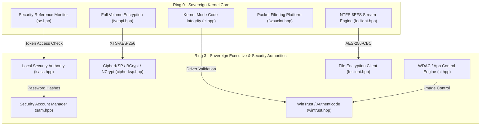
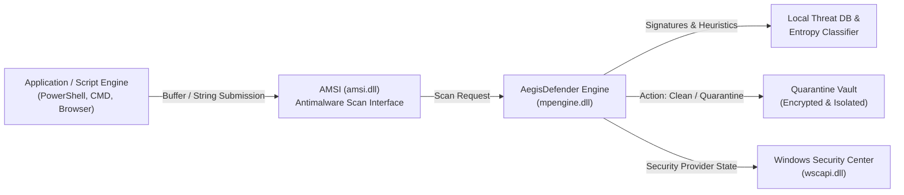

# Sentinel Security System for MicaNT: Sovereign Architecture & Endpoint Protection Roadmap

**Document Reference:** `docs/SECURITY_ROADMAP.md`  
**Classification:** Sovereign Systems Architecture & Defense Blueprint  
**Subsystem Lineage:** Project MICA (Dave Cutler 1988) ➔ Sentinel Security System (SentinelSec, SentinelCenter, AegisDefender)  
**Status:** Active Architectural Charter  

---

## 1. Executive Summary

In Windows, the security model relies on a mix of Ring 0 kernel isolation and a sprawling collection of user-mode daemons (Windows Defender / `MsMpEng.exe`, Security Center / `wscsvc`, SmartScreen, and Defender for Endpoint / ATP). While historically effective, the commercial Windows implementation suffers from:
1. **Intrusive Telemetry**: Every executable hash, script invocation, and document metadata is frequently beaconed to the cloud (SmartScreen / Defender ATP cloud telemetry).
2. **Resource Bloat**: Windows Defender often consumes 250 MB to 1+ GB of idle RAM and causes aggressive CPU spikes during routine I/O.
3. **Black-Box Decision Logic**: Threat heuristics and cloud-dependent signatures provide little transparency to systems engineers and security auditors.

**MicaNT's Security Mandate:** Build a **first-principles, sovereign, memory-safe (ISO C++23), 100% telemetry-free** security and endpoint protection ecosystem that provides complete Win32/NT ABI compatibility while running in sub-32 MB of memory with deterministic latency and absolute user sovereignty.

---

## 2. Current State: MicaNT Security Foundations (Phases 1–108)

MicaNT already possesses one of the most complete, verified clean-room cryptographic and access-control foundations ever constructed:

### Deployed Subsystems (135/135 Test Suites Passing):
1. **SentinelSec (`se.hpp`, `sam.hpp`, `lsass.hpp`)**:
   - Security Reference Monitor (SRM), Security Descriptors, DACLs, SACLs, Access Tokens (`SeAccessCheck`, `NtOpenProcessToken`).
   - SAM user/group database with salted PBKDF2/SHA-256 password hashing.
   - Privilege validation (`SeDebugPrivilege`, `SeShutdownPrivilege`, etc.).
2. **CipherKSP (`cipherksp.hpp`, `bcrypt.dll`, `ncrypt.dll`)**:
   - Cryptography Next Generation (CNG) parity: SHA-256/384/512, AES-128/256 (CBC, CTR, ECB, XTS), CSPRNG.
3. **Full Volume Encryption / FVE (`fveapi.hpp`, `fveapi.dll`, `manage-bde`)**:
   - BitLocker volume encryption compatibility, TPM 2.0 PCR-7/11 sealing, 48-digit numerical recovery passwords.
4. **Windows Filtering Platform / WFP (`fwpuclnt.hpp`, `fwpuclnt.dll`, `netsh advfirewall`)**:
   - Deep packet inspection, stateful IPv4/IPv6 packet filtering, application-aware network isolation.
5. **WinTrust & CatRoot (`wintrust.hpp`, `wintrust.dll`, `signtool`)**:
   - Authenticode PKCS#7 digital signature validation, PE SHA-256 Authenticode hashing, security catalog database.
6. **Code Integrity & WDAC (`ci.hpp`, `ci.dll`, `wdac`)**:
   - Kernel-Mode Code Integrity (KMCI) driver enforcement, User-Mode Code Integrity (UMCI / WDAC) allow/deny rules (Hash, Publisher, Path), HVCI simulation.
7. **Encrypting File System / EmeraldCrypt (`feclient.hpp`, `feclient.dll`, `cipher`)**:
   - Per-file AES-256 symmetric encryption, NTFS `$EFS` alternate data stream, multi-user DDF, corporate DRA recovery, zero-knowledge raw streaming, DoD 5220.22-M disk sanitization.
8. **AegisSandbox (`ps.hpp`, `section.hpp`)**:
   - Win32 Job Object containment, CPU rate limits, working-set memory fences.
9. **WebAuthn / FIDO2 (`webauthn.hpp`, `webauthn.dll`)**:
   - Hardware passkeys and credential generation.

---

## 3. Gap Analysis: What Windows Defender Provides vs. What MicaNT Needs

To achieve full operational parity with Windows Defender without any of the cloud-telemetry downsides, MicaNT requires the following five layers:

| Security Dimension | Proprietary Windows Implementation | MicaNT Sovereign Solution |
| :--- | :--- | :--- |
| **System Health Aggregation** | Windows Security Center (`wscapi.dll` / `wscsvc`) | **SentinelCenter (`wscapi.hpp`)**: Real-time aggregation of Firewall, Defender, BitLocker, and UAC with standard Win32 C ABI. |
| **Runtime Script & Buffer Inspection** | Antimalware Scan Interface (`amsi.dll`) | **Sovereign AMSI (`amsi.hpp`)**: `AmsiScanBuffer` & `AmsiScanString` allowing shells and script runtimes to scan memory before execution. |
| **Antivirus / Threat Detection Engine** | Microsoft Malware Protection Engine (`mpengine.dll` / `MsMpEng.exe`) | **AegisDefender (`mpengine.hpp`)**: Local-first scan engine with signature pattern matching, PE section entropy analysis, and quarantine vault. |
| **Cloud Surveillance / Telemetry** | SmartScreen / Defender ATP cloud telemetry (beacons data to MS servers) | **Zero Cloud Transmission**: 100% offline, local heuristic analysis with optional reproducible open-source definition updates. |
| **Process Exploit Mitigations** | Windows Exploit Guard (DEP, ASLR, CFG, ACG) | **Process Mitigation Policy (`mitigation.hpp`)**: Ring 0 hardware NX/DEP bit enforcement, ASLR address randomization, strict handle limits. |
| **Credential Dumping Defense** | Credential Guard / Virtualization-Based Security (IUM) | **Sovereign Credential Guard (`credguard.hpp`)**: Isolated token vault preventing unprivileged Ring 3 memory reads of SAM/LSA secrets. |

---

## 4. The 5-Phase Sovereign Security Roadmap

### Phase 1: Windows Security Center Subsystem (`wscapi.dll` / `wscapi.h` - SentinelCenter) - **COMPLETED (Milestone 136)**
- **Goal**: Build the central health aggregator for the entire operating system.
- **Implemented Components**:
  - `include/micant/wscapi.hpp` exporting `wscapi.dll`.
  - Win32 C ABI: `WscGetSecurityProviderHealth`, `WscRegisterForChanges`, `WscUnRegisterChanges`, `WscQueryAntiVirusStatus`, `WscRegisterProduct`, `WscUnregisterProduct`, `WscUpdateProductStatus`, `WscGetAntiVirusProducts`, `WscFreeMemory`.
  - COM Interfaces: `IWscProduct`, `IWscProduct2`, `IWscProduct3`, `IWSCProductList` with standard reference counting.
  - Pre-seeded Providers: Firewall (WFP), Antivirus (AegisDefender), Servicing (CBS), User Account Control (UAC), Core Service (`wscsvc`).
  - CLI: `wsc` (`wsc status`, `wsc health [provider]`, `wsc products`, `wsc test`).
  - Verification: Unit Test Suite 136 (`Test_WindowsSecurityCenter_WSC_Subsystem`) passing at 100%.

### Phase 2: Antimalware Scan Interface (AMSI - `amsi.dll` / `amsi.h`)
- **Goal**: Enable applications, scripts, and command shells to submit code buffers to the antimalware engine before execution.
- **Components**:
  - `include/micant/amsi.hpp` exporting `amsi.dll`.
  - APIs: `AmsiInitialize`, `AmsiOpenSession`, `AmsiScanBuffer`, `AmsiScanString`, `AmsiCloseSession`, `AmsiUninitialize`.
  - Result Codes: `AMSI_RESULT_CLEAN`, `AMSI_RESULT_NOT_DETECTED`, `AMSI_RESULT_DETECTED`, `AMSI_RESULT_BLOCKED_BY_ADMIN`.
  - Integration with MicaNT command prompt (`cmd.hpp` / `shell.hpp`).

### Phase 3: AegisDefender Antimalware Engine (`mpengine.dll` / `MpCmdRun.exe`)
- **Goal**: Full clean-room file scanner and threat remediation engine.
- **Components**:
  - `include/micant/mpengine.hpp` exporting `mpengine.dll`.
  - Core Capabilities:
    1. **Signature Database**: Local binary definitions matching known malicious shellcode and exploit payloads.
    2. **PE Section Entropy Heuristics**: Calculates Shannon entropy of PE image sections (`.text`, `.data`, `.rsrc`) to detect packed or encrypted malware droppers.
    3. **Quarantine Vault**: Encrypted on-disk store (`C:\ProgramData\MicaNT\Quarantine`) using AES-256 to isolate detected threats safely.
    4. **Remediation Actions**: Clean, Quarantine, Remove, Allow.
  - CLI: `mpcmdrun` / `defender` (`mpcmdrun -Scan -ScanType 1`, `mpcmdrun -ListQuarantine`, `mpcmdrun -Restore`).

### Phase 4: Process Exploit Mitigations & Hardening (`mitigation.hpp`)
- **Goal**: Memory defense preventing buffer overflows, shellcode execution, and ROP gadgets.
- **Components**:
  - Win32 API: `SetProcessMitigationPolicy`, `GetProcessMitigationPolicy`.
  - Policies: Data Execution Prevention (DEP / NX bit), High-Entropy ASLR, Arbitrary Code Guard (ACG - prevents dynamic code execution in heap/stack), Strict Handle Checks.

### Phase 5: Sovereign Credential Guard & Isolated Security Mode (IUM)
- **Goal**: Isolate high-privilege credentials (Kerberos tickets, NTLM/PBKDF2 hashes, LSA secrets) into a memory-fenced enclave protected from user-mode debuggers and Ring 3 dumping tools.

---

## 5. Architectural Principles

1. **Zero Telemetry**: All threat determinations happen locally on the CPU. No file hashes, IP addresses, or script strings are ever transmitted over the network.
2. **Sub-32 MB Footprint**: The entire security engine must idle in less than 8 MB of RAM, compared to 500+ MB for commercial equivalents.
3. **Strict Clean-Room Provenance**: Built exclusively using public Microsoft Win32 APIs, NIST cryptographic standards, and open specifications.
4. **100% Test Automation**: Every layer is backed by dedicated unit test suites guaranteeing 100% pass rates on both Clang and MSVC.
